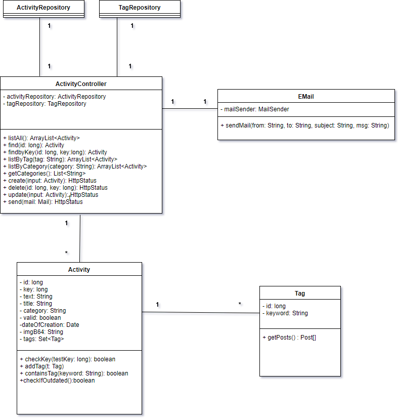
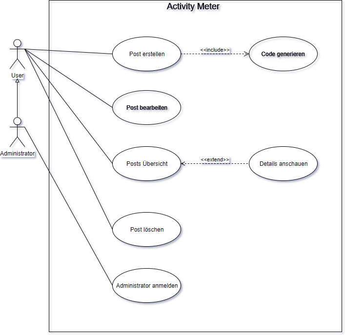

### Systemidee

Entwicklung einer Webanwendungen zur Darstellung von Aktivitäten.

[Link]: https://swei-tgb2-4.herokuapp.com/

### Screenshots

### Systemarchitektur als Fachklassenmodell

### Anwendungsfalldiagramm

:trollface:
