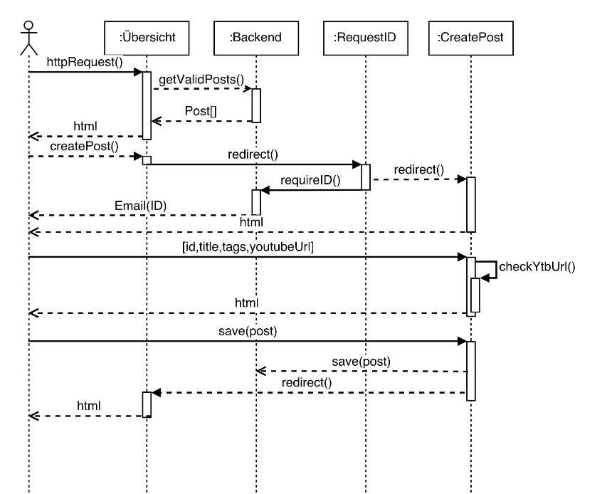
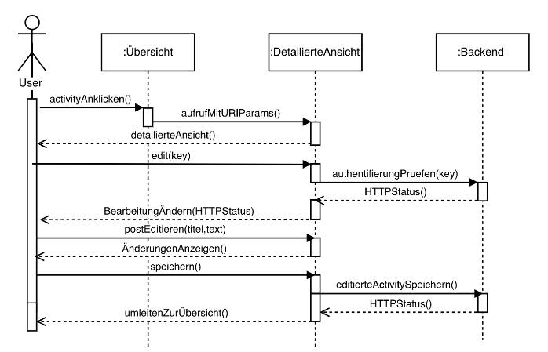

### Systemidee

Entwicklung einer Webanwendungen zur Darstellung von Aktivitäten.

[Link]: https://swei-tgb2-4.herokuapp.com/

### Übersicht

Hier wird jede Aktivität mit einem Punkt dargestellt. Dabei repräsentiert eine Farbe jeweils eine Kategorie. Wenn man mit dem Cursor über einen Punkt fährt, bekommt man eine kurze Zusammenfassung des Post angezeigt. Durch einen Mausklick auf einen Punkt öffnet man die vollständige Darstellung der entsprechenden Aktivität. Mit Hilfe des seitlichen Menüs können Post gefiltert und gruppiert werden.

### Mail mit ID anfragen

Um einen neuen Post erstellen zu können benötigt man zunächst eine eindeutige ID, welche an die angegebene E-Mail versand wird.

### Post erstellen

Nachdem man die ID erhalten hat kann man mit dieser einen neuen Post verfassen. Optional ist das anfügen eines Bildes oder YouTube-Videos möglich.

### Post anschauen

Nachfolgend kann man die ausführliche Darstellung einer Aktivität sehen.

### Systemarchitektur als Fachklassenmodell

### Anwendungsfalldiagramm

### Umsetzung

Nachfolgend wird der Ablauf beim Erstellen eines neuen Posts per Sequenzdiagramm dargestellt.

Das editieren einer Aktivität wird folgendermaßen umgesetzt:

:trollface:
